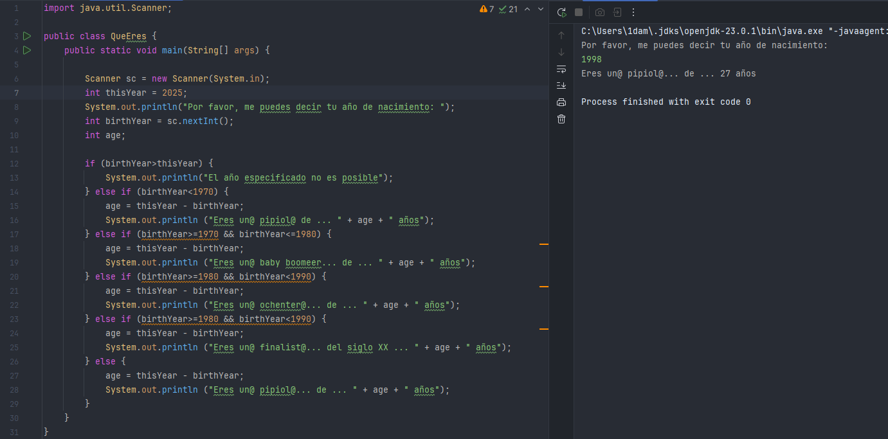
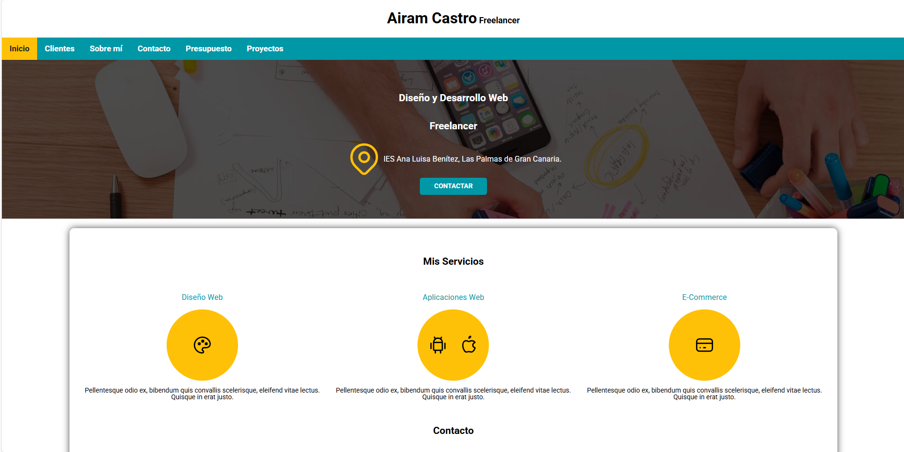

# Proyecto "Portfolio"

## ¡Bienvenid@ a este repositorio! 👋

## ¿Quién soy? ❓
Hola, mi nombre es Airam. Soy un apasionado por el mundo de la informática y estudiante de DAM.

He decidido incluir 3 de los proyectos que he realizado a lo largo del curso.

Adéntrate y siéntete libre de navegar entre los diferentes proyectos que encuentras dentro del repositorio.

## 1. QueEres

### 🤓 Descripción del proyecto:
Este pequeño ejercicio de programación trata de saber tu año de nacimiento y, a raíz de ahí, te dirá expresamente qué eres coloquialmente hablando.

### 💻 Tecnologías utilizadas:
❗ Java

### 📁 Instrucciones de instalación y ejecución:
Puedes descargar el proyecto mediante protocolo SSH o HTTPS con la herramienta de Git o simplemente descargar el proyecto o código fuente desde el botón verde principal.

Para ejecutarlo, al ser un proyecto hecho en Java, recomiendo IntelliJ como editor más comúnmente usado, aunque también puedes ejecutarlo en tu editor de texto o VSCode preferido.

### 📷 Capturas de pantalla o ejemplos de uso:

## 2. Freelancer

### 🤓 Descripción del proyecto:
Es un pequeño proyecto inicial cursado en la asignatura de LND, el cual trata de "hacer" como si nosotros mismos fuésemos freelancers y estuviésemos ofreciendo nuestros servicios online.

### 💻 Tecnologías utilizadas:
❗ HTML
❗ CSS

### 📁 Instrucciones de instalación y ejecución:
Puedes descargar el proyecto mediante protocolo SSH o HTTPS con la herramienta de Git o simplemente descargar el proyecto o código fuente desde el botón verde principal.

En este caso, al ser un proyecto en HTML, puedes acceder a cualquier sección de la "página" haciendo doble clic en los archivos que sean ejecutables por un navegador. Si quisieras editarlo, también puedes llevarlo a tu editor de texto favorito.

### 📷 Capturas de pantalla o ejemplos de uso:

## 3. Four-card-feature-section

### 🤓 Descripción del proyecto:
Esto es un examen que tuve que hacer en la asignatura de LND. Es corto y sencillo.

### 💻 Tecnologías utilizadas:
❗ HTML
❗ CSS

### 📁 Instrucciones de instalación y ejecución:
Puedes descargar el proyecto mediante protocolo SSH o HTTPS con la herramienta de Git o simplemente descargar el proyecto o código fuente desde el botón verde principal.

En este caso, al ser un proyecto en HTML, puedes acceder a cualquier sección de la "página" haciendo doble clic en los archivos que sean ejecutables por un navegador. Si quisieras editarlo, también puedes llevarlo a tu editor de texto favorito.

### 📷 Capturas de pantalla o ejemplos de uso:
